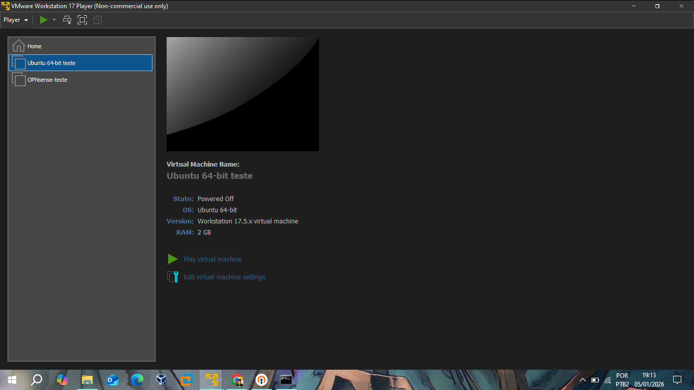
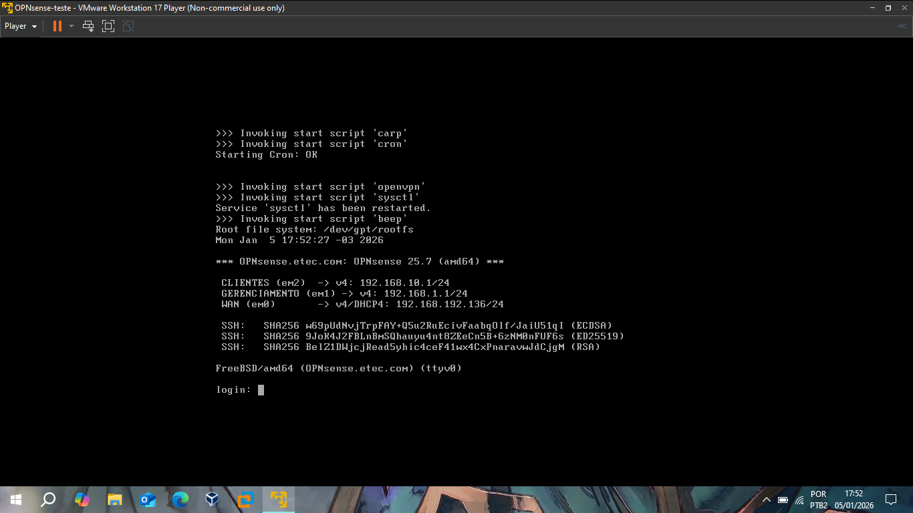
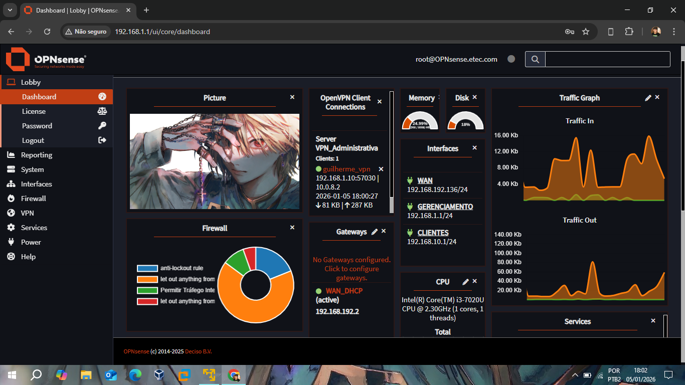
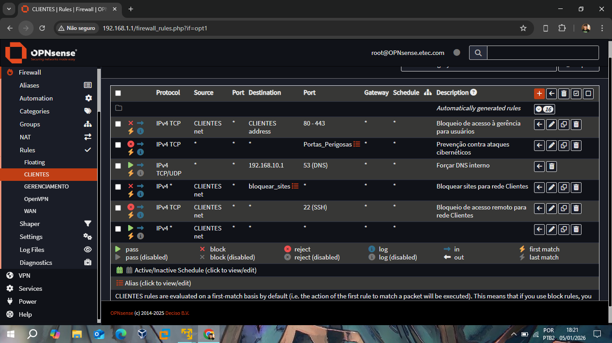

# 📂 Relatório 0: Setup do Ambiente e Conectividade Base

Este relatório documenta a infraestrutura inicial do projeto, detalhando a topologia de rede virtualizada e o acesso administrativo ao firewall.

## Topologia das Máquinas Virtuais
Para este projeto, utilizei o VMware Workstation 17 Player, foram utilizadas duas máquinas virtuais principais.

* **OPNsense 25.7:** Atuando como gateway de segurança e firewall de borda.
* **Ubuntu 18.04 LTS:** Atuando como estação de trabalho (Host) na rede interna (CLIENTES).

## Configuração de Interfaces (Networking)
O firewall foi configurado com três interfaces lógicas para isolamento de tráfego:

| Interface | Configuração (VMware) | Endereço IP | Função |
| :--- | :--- | :--- | :--- |
| **WAN(EM0)** | NAT | 192.168.192.136/24 | permitir que o firewall receba um IP dinâmico (192.168.192.136/24) e tenha acesso à Internet. |
| **GERENCIAMENTO(EM1)** | Host-Only | 192.168.1.1/24 | Esta interface é isolada e serve exclusivamente para que a minha máquina física (Windows) acesse a WebGUI com segurança. |
| **CLIENTES(EM2)** | LAN/Rede Interna | 192.168.10.1/24 | É a rede protegida onde o Ubuntu 18 estará posicionado, recebendo IPs via DHCP do OPNsense |

  
## Acesso Administrativo (WebGUI)
O acesso à interface de gerenciamento foi estabelecido através do navegador na máquina física, apontando para o IP da interface de Gerenciamento, no caso, a 192.168.1.1, e utilizar o mesmo usuário e a mesma senha configurada na linha de comandos do firewall

*Dashboard principal exibindo o status operacional das interfaces e serviços ativos, além de monitoramento de tráfego.*

## Planejamento de Regras de Firewall
As regras iniciais foram estabelecidas na interface **CLIENTES** para garantir a conectividade básica e preparar os bloqueios de segurança posteriores:
* **DNS:** Permissão para consultas ao servidor DNS interno.
* **HTTP/S:** Controle de navegação web.
* **SSH:** Preparação para gerência remota.

*Visualização das regras de firewall aplicadas à rede de clientes. Algumas regras foram criadas para permitir o tráfego essencial, outras serão contextualizadas e explicadas nos relatórios á frente.*
