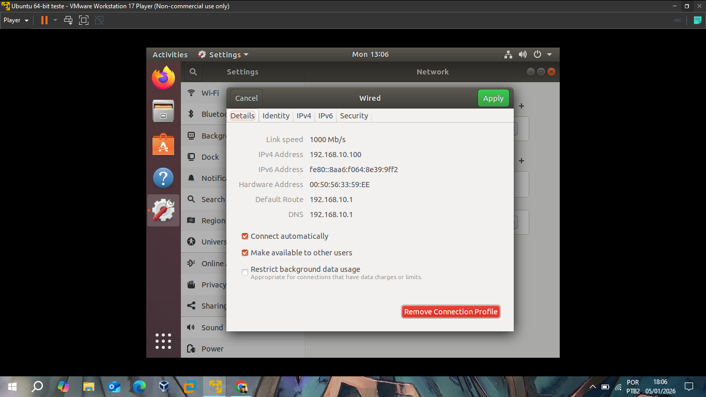
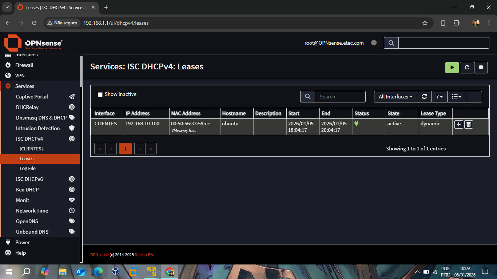

# 📂 Relatório I: Conectividade, DHCP e DNS

Este relatório documenta a validação da rede interna (CLIENTES), demonstrando o funcionamento dos serviços essenciais de infraestrutura: DHCP para atribuição dinâmica de endereços e DNS para resolução de nomes.

## 🔗 Conectividade do Host Ubuntu
O endpoint configurado com **Ubuntu 18.04** foi conectado à interface **CLIENTES** do firewall. A conectividade foi validada através da interface de rede do sistema operacional, confirmando o recebimento dos parâmetros de rede corretos.

*Configurações de rede recebidas pelo Ubuntu: IP `192.168.10.100`, Gateway `192.168.10.1` e DNS `192.168.10.1`.*

## 🌐 Servidor DHCP (ISC DHCPv4)
O OPNsense atua como servidor DHCP para a rede de clientes. A imagem abaixo comprova que o serviço está operacional e gerenciando ativamente os "leases" (concessões) de IP.

*Tabela de Leases exibindo o host `ubuntu` com o endereço IP `192.168.10.100` e o respectivo endereço MAC.*

## 🔍 Resolução de Nomes (DNS)
O serviço de DNS foi configurado para permitir que os clientes da rede interna resolvam nomes de domínio tanto internos quanto externos.
* **Gateway como DNS:** O host Ubuntu utiliza o IP da interface CLIENTES (`192.168.10.1`) como seu resolvedor primário.
* **Validação:** A navegação e a conectividade demonstradas nos testes subsequentes confirmam a integridade das consultas DNS através do firewall.

---
**Status do Módulo:** ✅ Concluído e Validado.
