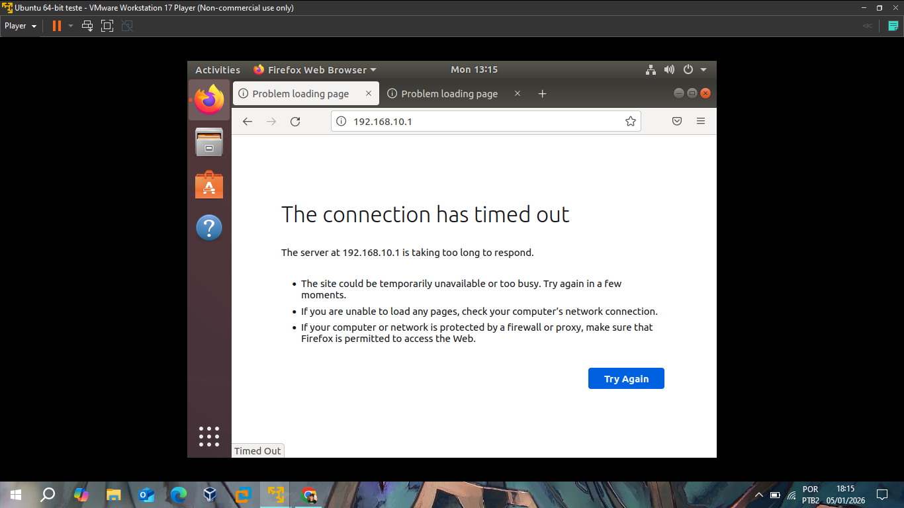
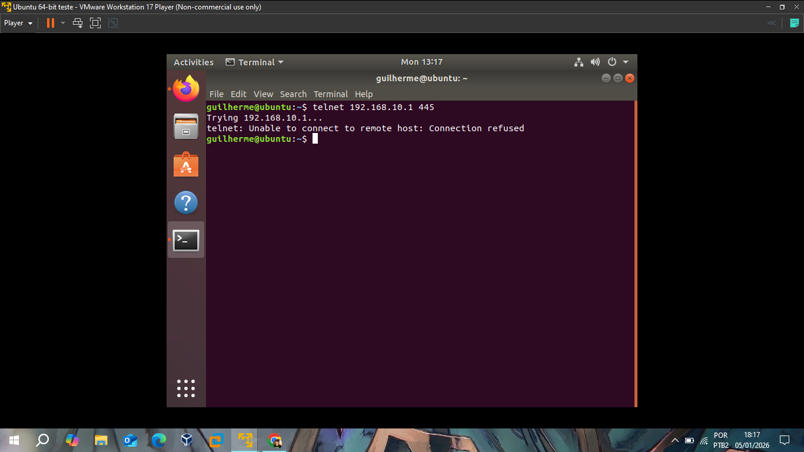
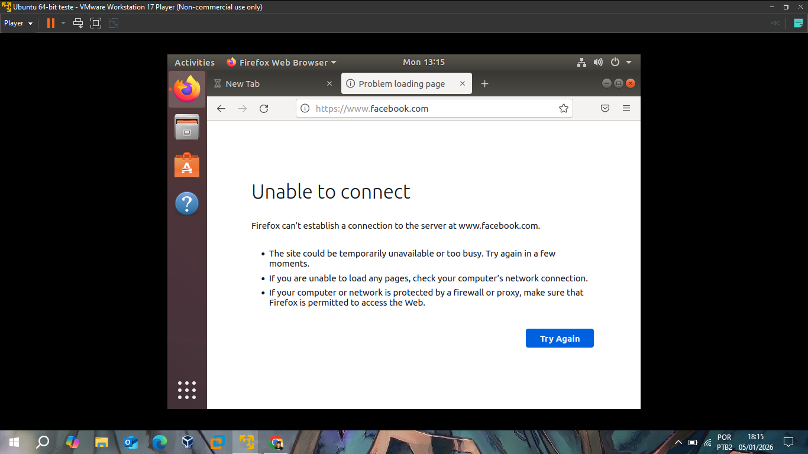
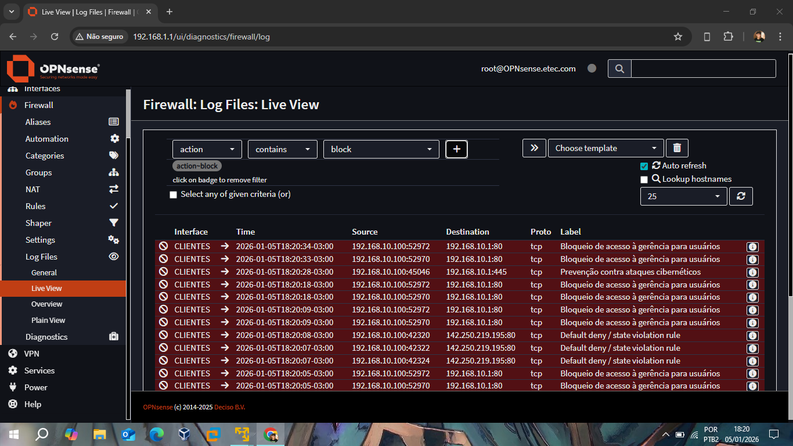

# 📂 Relatório II: Segurança de Rede e Filtragem de Pacotes

Este relatório detalha a implementação das políticas de segurança na interface **CLIENTES**, focando em garantir a integridade da rede interna através de bloqueios estratégicos e monitoramento em tempo real.

## Contextualização das Regras (Baseadas no Relatório 0)
Conforme apresentado no planejamento inicial, as regras foram estabelecidas seguindo o princípio do privilégio mínimo. Cada bloqueio possui uma justificativa técnica:

1. **Bloqueio de Gerência (WebGUI):** Impede que usuários comuns da interface de Clientes tentem acessar o painel administrativo do firewall.
2. **Prevenção contra Ataques Cibernéticos:** Fechamento de portas consideradas vulneráveis(como a 445/SMB) para evitar propagação de malwares.
3. **Bloqueio de Sites (Aliases):** Controle de produtividade e segurança, impedindo o acesso a redes sociais (ex: Facebook).

## Testes de Bloqueio e Comprovação (Lado do Cliente)

### 1. Bloqueio de Acesso à WebGUI
Tentativa de acesso ao IP do firewall da interface Clientes (`192.168.10.1`) a partir do navegador do Ubuntu.

*O navegador exibe "Timed Out", confirmando que a regra de bloqueio está descartando os pacotes silenciosamente, e perceba que o navegador já diz que uma das causas pode ser uma regra de bloqueio vinda do firewall.*

### 2. Bloqueio de Portas Lógicas (Portas Perigosas)
Teste realizado via terminal utilizando o comando `telnet` para validar o fechamento da porta 445.

*O status "Connection refused" comprova que o firewall está protegendo a rede contra acessos não autorizados em portas sensíveis.*

### 3. Filtro de Conteúdo (Sites)
Tentativa de acesso ao domínio `facebook.com`.

*O navegador falha ao carregar a página devido à regra de bloqueio de DNS/IP aplicada no firewall.*

## Monitoramento em Tempo Real (Logs)
A prova técnica definitiva é o **Live View** do OPNsense. Ele correlaciona as tentativas de acesso com as regras mostradas no Relatório 0.

*Filtrei para mostrar apenas os logs em vermelho, que exibem claramente a ação de **Block**, a interface (CLIENTES), o IP de origem (`192.168.10.100`) e a **Label** da regra que causou o bloqueio. Como se pode ver, ela monitora as tentativas de acesso a WebGUI do firewall e a conexão Telnet*

---
**Status do Módulo:** ✅ Concluído e Validado através de logs.
