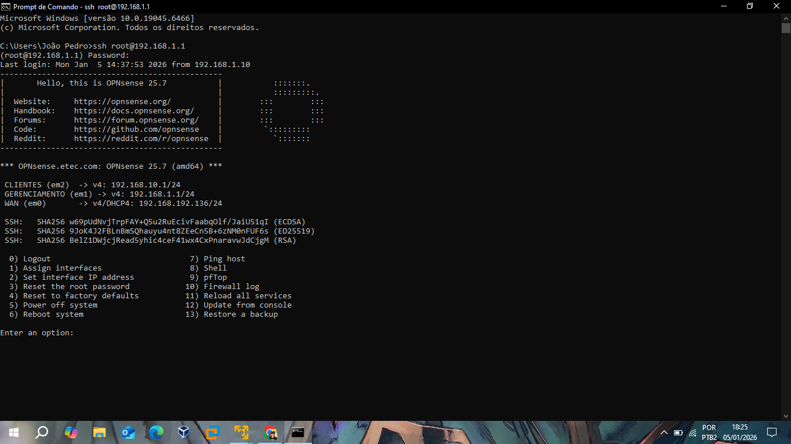
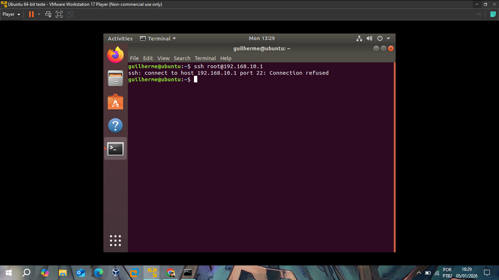
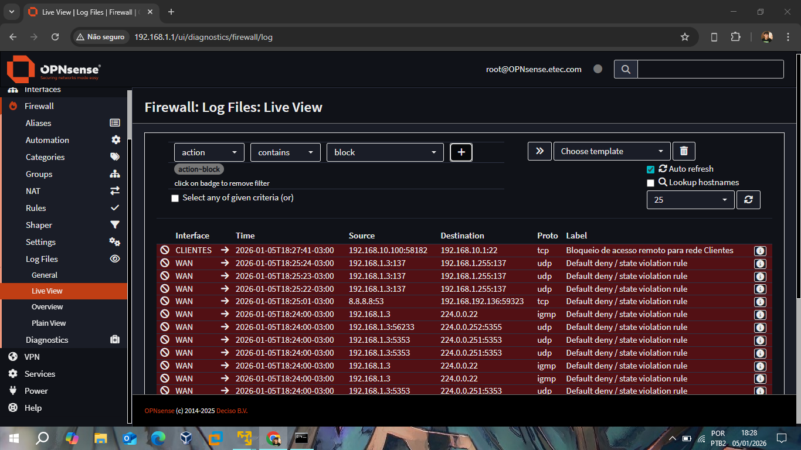

# 📂 Relatório III: Administração Remota via SSH

Este relatório documenta a configuração do serviço Secure Shell (SSH) para administração remota do firewall, demonstrando o controle de acesso baseado em interfaces.

## Acesso Autorizado (Interface de Gerenciamento)
O acesso administrativo via SSH foi habilitado para permitir a gerência do sistema através de linha de comando (CLI). Fiz teste bem sucedido a partir da máquina física (Windows) conectada à rede de Gerenciamento.

*Conexão SSH estabelecida com sucesso via meu terminal no Windows, exibindo o menu de administração do OPNsense 25.7.*

## Bloqueio de Acesso (Rede Clientes)
Seguindo a política de segurança definida no **Relatório 0**, o acesso remoto via SSH foi explicitamente bloqueado para a rede de **Clientes**. Esta medida impede que usuários internos tentem realizar alterações no firewall via terminal.

### Teste de Bloqueio no Ubuntu
Realizei a tentativa de conexão a partir do host Ubuntu (`192.168.10.100`) para o gateway (`192.168.10.1`) e o user Root.

*O status "Connection refused" confirma que o tráfego na porta 22 está sendo rejeitado pelo firewall.*

## Evidência nos Logs de Firewall
A eficácia da regra de bloqueio é comprovada através do monitoramento em tempo real (Live View), onde as tentativas vindas da rede interna são registradas.

*Logs exibindo o bloqueio da porta 22 (tcp) na interface CLIENTES, com a label "Bloqueio de acesso remoto para rede Clientes", comprovando a eficácia da regra mostrada no relatório 0.*

---
**Status do Módulo:** ✅ Concluído. Acesso administrativo isolado com sucesso.
