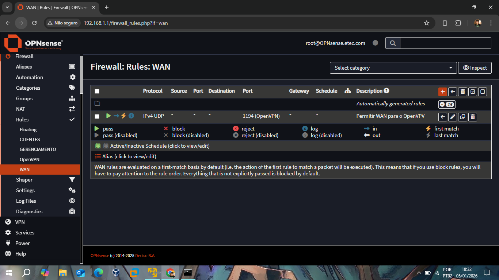
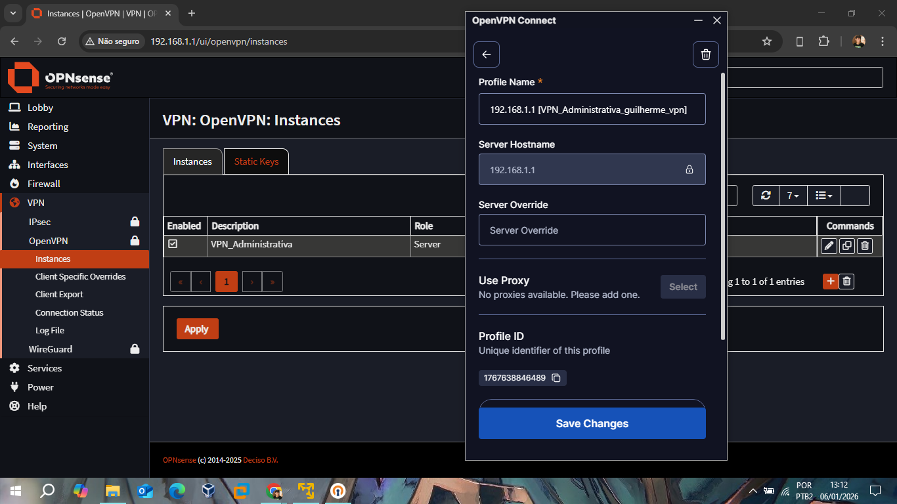
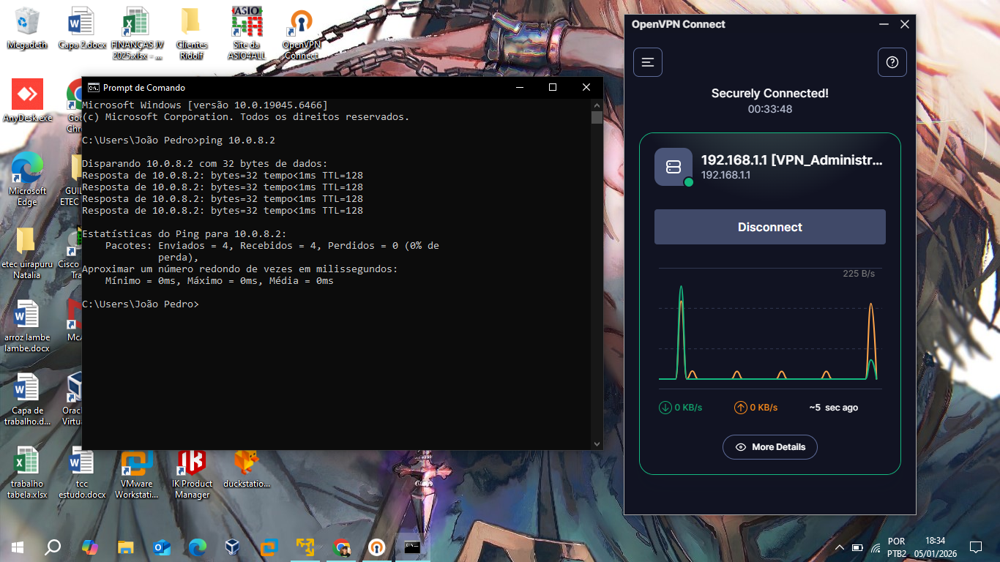
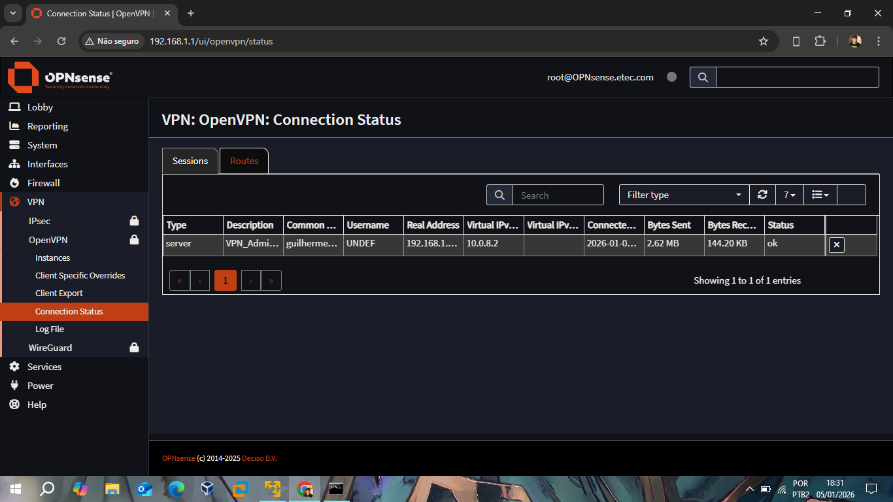

# 📂 Relatório IV: Acesso Remoto via OpenVPN

Este relatório descreve a mais difícil e e dasafiante etapa deste projeto, a implementação de uma VPN (Virtual Private Network) para acesso remoto seguro, detalhando a configuração de segurança e os testes de validação em ambiente de laboratório.

## Infraestrutura de Segurança e Regras WAN
A viabilização do túnel dependeu de duas configurações críticas realizadas na interface **WAN**, conforme planejado no **Relatório 0**:

1. **Regra de Firewall:** Liberação da porta **1194/UDP** para permitir o tráfego de entrada do protocolo OpenVPN.
2. **Ajuste de Perímetro:** Desativação do bloqueio de redes privadas (RFC 1918) na WAN, permitindo que o host físico (Windows) se comunique com o firewall virtualizado.

## Gestão de Identidades (PKI)
A segurança do túnel é baseada em certificados digitais, eliminando a dependência exclusiva de senhas:
* **Autoridade Certificadora (CA):** Criada internamente para assinar os certificados de servidor e cliente.
* **Autenticação:** O usuário `guilherme_vpn` utiliza uma combinação de certificado pessoal e credenciais de sistema para estabelecer a conexão.
* **Download:** O ultimo passo é baixar o arquivo do cliente `VPN_Administrativa_guilherme_vpn.ovpn` e adiciona-lo no **OpenVPN Connect**. 

## Validação e Testes de Conectividade
Devido às limitações de roteamento do ambiente virtualizado (VMware), o teste de sucesso foi realizado apontando para o endereço de escuta configurado.

### 1. Estabelecimento do Túnel
O cliente **OpenVPN Connect** no Windows confirmou a conexão segura com sucesso.

*Status "Securely Connected" e teste de **Ping** para o IP virtual `10.0.8.2` com latência inferior a 1ms, comprovando a integridade do tráfego.*

### 2. Monitoramento de Sessão no Firewall
Através da WebGUI, é possível confirmar a sessão ativa, verificando o IP real de origem e o tráfego gerado pelo usuário.

*Interface de gerenciamento exibindo o status "ok" e a sessão ativa do usuário autenticado.*

## ! Observação sobre o Ambiente Virtual
Vals ressaltar que os testes foram feitos sob algumaslimitações, como o Double NAT. Para garantir a funcionalidade no laboratório, foi utilizado o IP da interface de gerenciamento/WAN como Hostname de exportação, contornando restrições de roteamento do hardware físico.

---
**Status do Módulo:** ✅ Concluído. Túnel criptografado e funcional.
