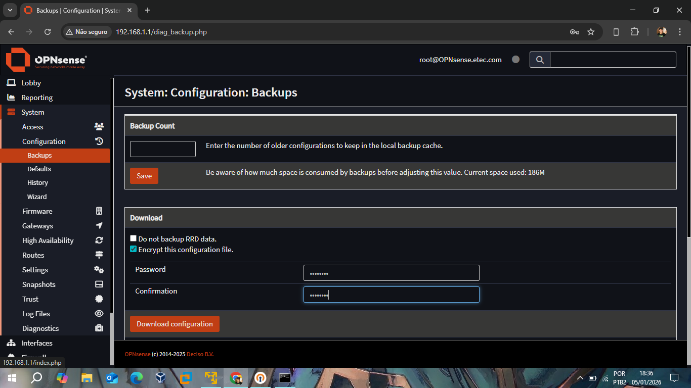
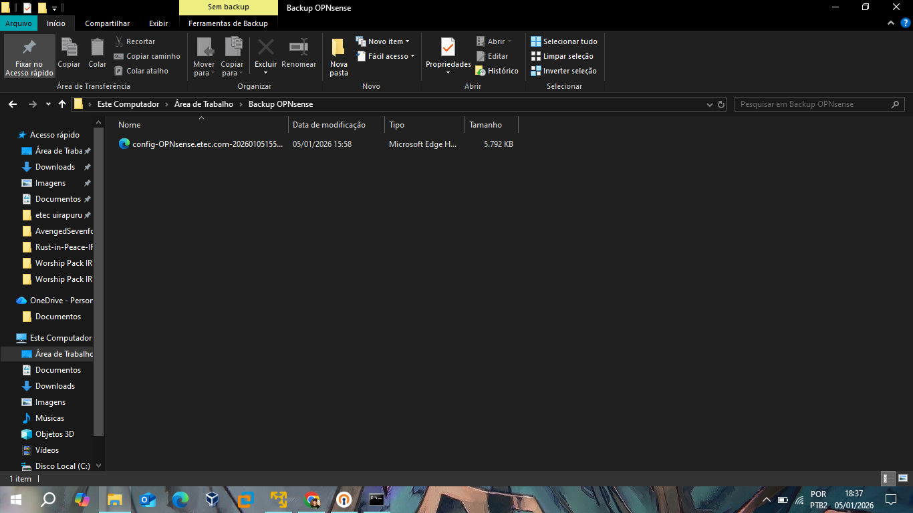

# 📂 Relatório V: Backup e Resiliência (Disaster Recovery)

Este relatório final documenta a estratégia de continuidade de negócio aplicada ao firewall OPNsense, garantindo a preservação de todas as configurações, regras e certificados implementados nos módulos anteriores.

## 🔒 Política de Backup Criptografado
A segurança da informação foi mantida até o processo de exportação. O backup não consiste apenas em um arquivo de texto, mas em um pacote de dados protegido para evitar o vazamento de chaves privadas e senhas.

*Interface de exportação configurada com a opção **"Encrypt this configuration file"** habilitada, utilizando criptografia AES-256.*

## 📁 Arquivo de Configuração (XML)
A inteligência de toda a rede foi consolidada em um arquivo compacto de aproximadamente 5.8 MB. Este arquivo contém:
* Definições de interfaces e IPs.
* Todas as regras de firewall e labels de log.
* Certificados digitais da CA e usuários da VPN.

*Evidência do arquivo `config-OPNsense...xml` salvo no diretório local, pronto para ser utilizado em uma eventual restauração de desastre (Disaster Recovery).*

## 🎯 Conclusão do Projeto
Com a execução deste último módulo, o projeto atingiu todos os objetivos propostos:
1. **Infraestrutura:** Conectividade base e serviços DHCP/DNS validados.
2. **Segurança:** Bloqueios de perímetro e filtros de conteúdo comprovados via log.
3. **Acesso Remoto:** Túnel OpenVPN estabelecido com criptografia de ponta a ponta.
4. **Resiliência:** Garantia de continuidade através de backups seguros.

---
**Status Final do Projeto:** ✅ Concluído, Documentado e Protegido.
